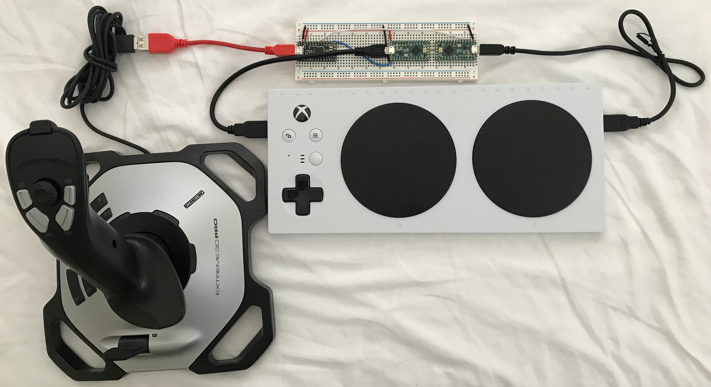
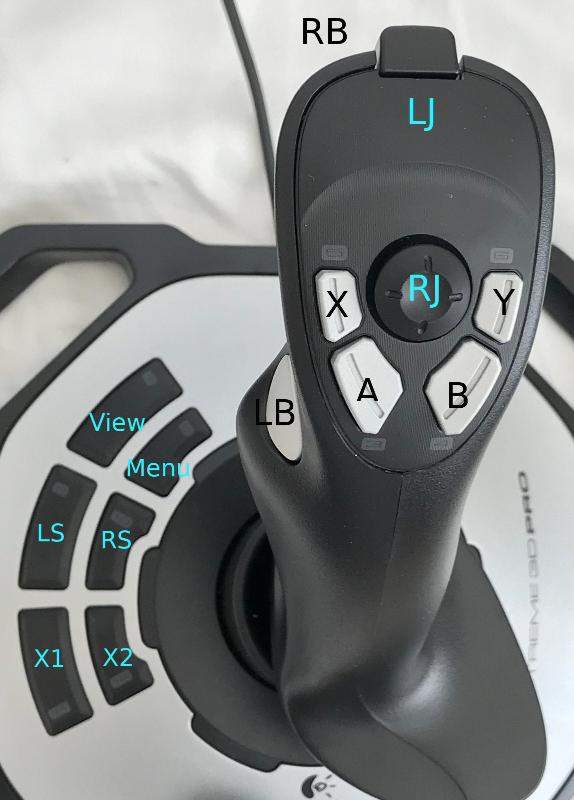
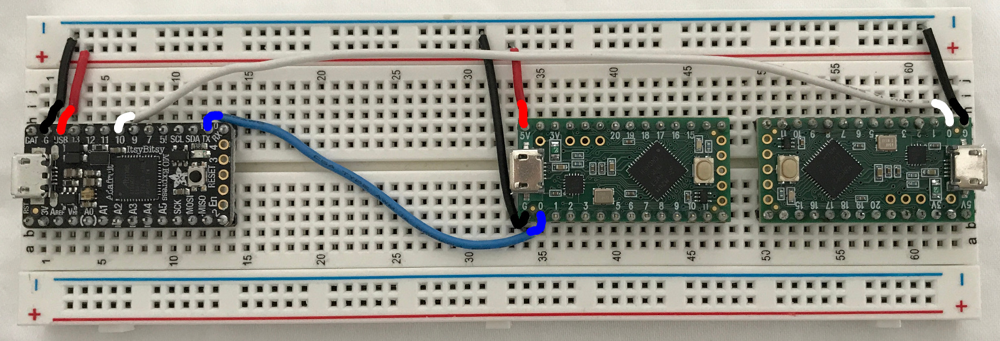

# Logitech Flight Stick for Xbox Adaptive Controller

The Microsoft Xbox Adaptive Controller (XAC) ignores the hat switch on the
Logitech Extreme 3D Pro flight stick. The joystick splitter project is one way
to solve this problem using Arduino compatible boards.

NOTE: A few people have pointed that using joysticks, keyboards, mice,
head trackers, etc. with consoles is not new. If you do not need the XAC for
button and switch inputs, consider the following alternatives. Or use one of
the following with an XAC if you do not want to bother with building the
joystick splitter. I have not used any of them so you will have to investigate
on your own.

* The [GIMX](https://gimx.fr) open source project.
* [CronusMax](https://cronusmax.com/)
* [Titan Two](https://www.consoletuner.com/)
* [Xim APEX](https://xim.tech/)

## What works
* Joystick X,Y maps to the left thumbstick
* Hat 8-way switch maps to the right thumbstick
* 4 top buttons map to A, B, X, Y
* Front trigger maps to right bumper
* Side trigger maps to left bumper

## Not supported
* Throttle
* Joystick Z axis (twist)

## Nice to have
* Configuration file to remap controls but this can be done using the console.

## Hardware components

* 1 x Logitech Extreme 3D Pro Flight Stick (LE3DP)
* 1 x Microsoft Xbox Adaptive Controller (XAC)
* 1 x Adafruit ItsyBitsy M0 (IBM0)
* 1 x USB OTG to host cable or adapter
* 2 x PJRC Teensy LC boards (TLC)
* 2 x USB cable with micro USB connector
* Breadboard, headers, wire, etc.

## Software

* joyuart  -- Joystick emulator for Teensy LC boards
* joysplit -- Joystick USB host for ItsyBitsy M0

## How this works

The LE3DP plugs into the ItsyBitsy M0 via the USB OTG cable. The IBM0 can talk
to the LE3DP because the IBM0 works in USB host mode. The joysplit code running
on the IBM0 extracts the joystick axes, hat switch, and buttons events.
joysplit sends the joystick events to one Teensy LC (TLC) and the hat switch
events to the other TLC. The button changes are divided up as needed so the
defaults are useful. One TLC plugs into the Xbox Adaptive Controller (XAC)
left USB port and the other plugs into the XAC right USB port. The IBM0 and
TLCs talk to each other via UART ports.

The result is the big joystick works as the Xbox left stick and the hat switch
works as the Xbox right stick. The top buttons work as A, B, X, Y, right bumper,
and left bumper.

The TLCs are powered over USB from the XAC. One TLC powers the IBM0 which in
turn powers the LE3DP.

## Software build enviroment

### joysplit

* Install Arduino IDE 1.8.7. Follow the insturctions at arduino.cc.
* Use IDE board manager to install the Arduino SAMD board package.
* Install the Adafruit SAMD board package following the [directions](https://learn.adafruit.com/introducing-itsy-bitsy-m0) at
  adafruit.com. Be sure the IBM0 board works before continuing.
* Install [USB Host Library for
  SAMD](https://github.com/gdsports/USB_Host_Library_SAMD) using "git clone" or
  by downloading a zip file.
* Set the board type to Adafruit ItsyBitsy M0 then upload joysplit.ino.

### joyuart

* Use the same Arduino IDE as above.
* Install TeensyDuino 1.44. Follow the instructions at pjrc.com.
* Unzip the patches for the joystick (joystick_teensy_20181107.zip) over the
  TeensyDuino files.
* Set the board type to Teensy LC and the USB Type to Joystick. Do not use the
  other USB Type options for joystick. They do not work with the XAC.
* Upload joyuart to the TLCs.

In both cases, the IDE automatic upload will not work once the programs have
been uploaded. The solution for the IBM0 is to double click the reset button
to put it in upload mode. The solution for the TLC is to click the
program/reset button once to upload.

Connect the boards as shown in the photo. Bread board connections can get
loose and unreliable after a while. Soldering everything down on proto board
results in a permanent solution.

Connections between boards.

Left TLC    |ItsyBitsy M0   |Right TLC
------------|---------------|---------
GND         |GND            |GND
5V          |USB            |---
0-RX        |1-TX           |---
---         |10-TX          |0-RX

The photo is touched up to clarify the wiring connections. Due to the wonders
of parallax, the wires on the far right and left appear to be off by one pin
without touch up.
